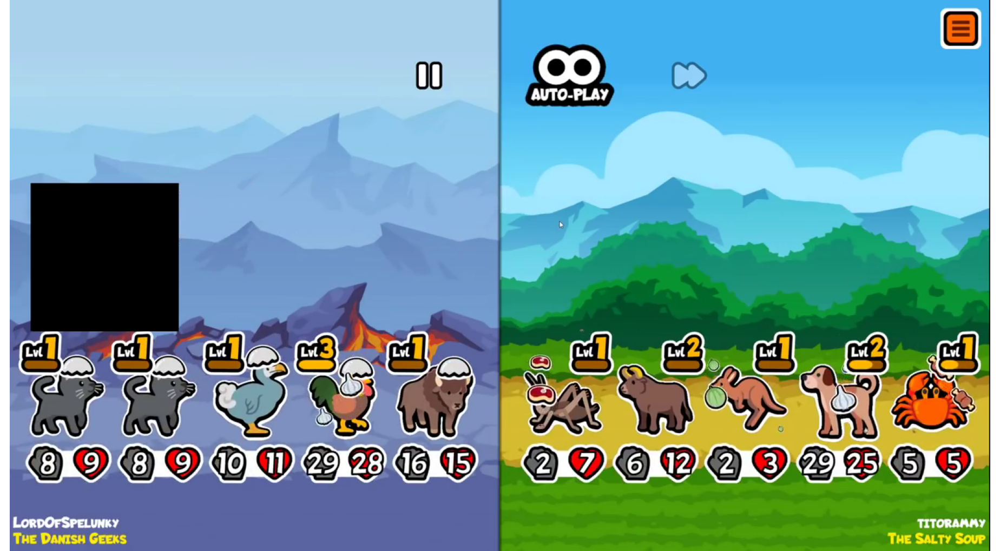
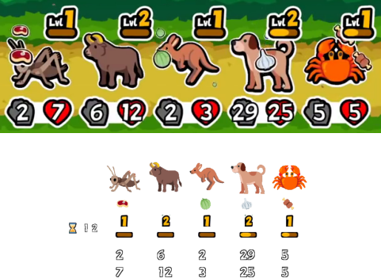

# SuperAutoPets Team Extractor

This repository contains code that extracts enemy teams in the [SuperAutoPets](https://store.steampowered.com/app/1714040/Super_Auto_Pets/) game from Youtube videos of streamer.
The code only uses standard computer vision tools such as pattern matching (using opencv).
For now, the script can only recognize pets from the main pack and from the first extension pack.

## Requirements

- python3
  + numpy
  + matplotlib
  + opencv-python
  + (optional) [yt-dlp](https://github.com/yt-dlp/yt-dlp) to download Youtube video (with the `process_videos.py` script)
- inkscape (for the image downloader script, to convert SVG files to PNG)

## Usage

The extractor code also needs the pets and objects images of SuperAutoPets, which are based on emojis from three opensource repositories:
- [Twitter emojis](https://github.com/twitter/twemoji)
- [Google emojis](https://github.com/googlefonts/noto-emoji)
- [Mozilla emojis](https://github.com/mozilla/fxemoji)

In order to download the necessary images, clone the three emoji repositories in a directory (e.g. `emoji_dir`) and run the python script:
`python3 download_imgs.py path/to/emoji_dir/`.
This will create a new directory `imgs/` containing images for all pets and status that the script use to recognize each element in enemy teams.

Once the images have been downloaded, run `python3 team_extractor.py path/to/video/` to start extracting every enemy team from a SuperAutoPets game video.
The path can be a video or a directory, in which case the script will by default look for a file named `video.mp4` in the given directory.
The script accepts several options:
- `-o` or `--output`: the directory in which to save the extracted teams. By default, the output directory is the base directory of the path given as argument.
- `-f` or `--nb_finders`: the number of processes that search for the first frame of every battle in the given video. The video is then split in `-f` equal parts, each one managed by one process.
- `-e` or `--nb_extractors`: the number of processes that actually extract teams from the frames found by the finders.
- `--sync`: force `-f 1 -e 1` and run without multiprocessing, mainly for debugging purpose or for slow computers.

In the output directory, the script will save two kinds of files:
- For each team, a `png` file with the frame of the video from which the team has been extracted, along with a visual summary of the information extracted from this frame in order to check easily if any mistake has been made.
- A file `team_list.txt` containing the summary of all the extracted teams. Each line of this file corresponds to a team, following the following format: \
  `turn_number (PetName1 Attack1 Life1 XP1 Status1) (PetName2 Attack2 Life2 XP2 Status2) ...`\
The XP value corresponds to the number of time the pet has been combined with another pet of the same type: so 0 corresponds to Lvl 1, 1 to Lvl 1+1/2, 2 to Lvl 2 etc.

The `process_videos.py` script can be used to process batch of videos successively. Given a video id, it first download it in the directory `checks/{video_id}/video.mp4` and then process it (i.e. extract every enemy team appearing in it).
It takes a list of arguments, which can be of two kinds:
- Youtube video ids (i.e. 11 character long strings)
- paths to text files containing one video id per line
It also accepts the following options:
- `-f` or `--nb_finders`: same as for `team_extractor.py` (this option simply will be passed to the script).
- `-e` or `--nb_extractors`: same as for `team_extractor.py` (this option simply will be passed to the script).
- `-d` or `--nb_downloaders`: the number of Youtube videos to download in parallel (if the given video id can't be found in the directory `checks/{video_id}`).
- `--download_only`: only download videos without processing them, mainly for debugging purpose.

## Example

The following frame will be processed as follows:

Whole frame: 

Extracted team visual summary: \

Textual summary: \
`12 (cricket 2 7 0 steak_attack) (ox 6 12 2 none) (kangaroo 2 3 0 melon_armor) (dog 29 25 4 garlic_armor) (crab 5 5 1 bone_attack)`
